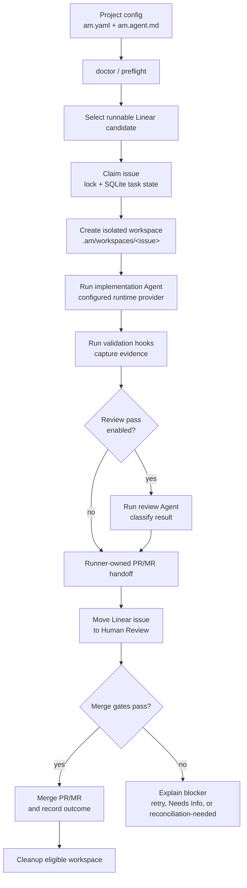

# Agent Machine

Agent Machine is a local-first runner for operators and contributors who want
well-scoped Linear issues turned into small, reviewable GitHub PRs or GitLab
MRs. It selects runnable issues, claims work, creates isolated workspaces, runs
a configured Agent runtime, validates the result, optionally runs a separate
review pass, and hands branches to the code host for human review.

The runner is intentionally conservative: it records local evidence, keeps
runtime state under the configured workspace root, and fails closed when scope,
ownership, state, credentials, or merge readiness are unclear. The project is
preparing for a v0.1 open-source release and currently dogfoods itself.

## What It Does

- Polls a configured Linear project for runnable issues.
- Creates one isolated workspace per issue under `.am/workspaces/`.
- Runs an implementation Agent through a configured runtime provider.
- Runs validation hooks before and after the Agent attempt.
- Performs runner-owned code-host handoff: branch, commit, push, PR/MR
  create/update, identity validation, and deterministic handoff comments.
- Optionally runs a separate review pass before moving the Linear issue to
  Human Review.
- Records local SQLite state, progress snapshots, run records, evaluation
  artifacts, review classifications, cleanup decisions, and worker results.
- Merges only when conservative gates pass: expected branch/base/repository,
  approval, green checks, review evidence, app/author ownership, and clean state.



## Product Boundary

Agent Machine is a local issue-to-PR runner with durable evidence. Features
belong in the core runner only when they help one configured repository move one
well-scoped Linear issue to one reviewable PR/MR with trustworthy local and
code-host evidence.

Current core behavior is intentionally narrow:

- select one runnable Linear issue;
- prepare one isolated workspace;
- run one bounded implementation attempt;
- produce or update one owned PR/MR;
- record the run, review, handoff, status, and ledger evidence needed to audit
  what happened.

Safety and operations features support that core. Review, scope guards,
branch/PR ownership checks, merge gates, reconciliation, cleanup, doctor,
status, and live smoke evidence should remain runner-owned policy or local
observability. They should not become separate products with their own lifecycle
rules.

Future surfaces such as TUI, web UI, MCP, ACP/editor adapters, or cloud runners
must stay thin adapters over the runner modules. They may present status, accept
operator intent, or trigger existing runner modes, but they should not duplicate
issue selection, handoff, review, merge, retry, cleanup, or reconciliation
policy.

## Current Status

This repo owns the runner implementation, tests, specs, code-host/Linear
integrations, CLI, release packaging, and dogfood configuration. Consumer repos
should keep only their `am.yaml`, `am.agent.md`, and ignored
`.am/` runtime state.

Agent Machine is released under the MIT License. See
`docs/release/v0.1-readiness.md` for the current release checklist.

## Requirements

- Go through `mise` (`mise install`, then `mise exec go -- ...`).
- `codex` CLI on `PATH` for the default `codex_cli` runtime.
- Optional: `pi` CLI on `PATH` when `runtime.provider: pi_cli` is configured.
- Optional: `claude` CLI on `PATH` when `runtime.provider: claude_cli` is
  configured.
- A Linear API token.
- Code-host credentials for the configured repository provider:
  `GITHUB_TOKEN` / `GH_TOKEN` or GitHub App credentials for GitHub, or
  `GITLAB_TOKEN` / `GL_TOKEN` for GitLab.

## Install

Tagged releases publish macOS and Linux archives for `amd64` and `arm64`.
Download the archive for your platform, verify it against `checksums.txt`, and
put the `am` binary on `PATH`.

When the Homebrew tap is configured, macOS users can install the cask:

```bash
brew install --cask weskor/tap/agent-machine
am --version
```

Linux users should use the release archives unless and until Linux packages are
added. For local development, run:

```bash
mise install
mise exec go -- go run . --version
```

## Quick Start

Create the two project files in the target repository:

```bash
cp am.example.yaml /path/to/target/am.yaml
cp am.agent.example.md /path/to/target/am.agent.md
```

Edit `/path/to/target/am.yaml` for the target repository:

- `repository.remote`: clone URL for new workspaces.
- `repository.provider`: `github` by default; use `gitlab` for GitLab MRs.
- `tracker.project_slug`: Linear project slug.
- `workspace.root`: workspace directory, usually `.am/workspaces`.
- `workspace.base_branch`: PR/MR base branch, for example `main` or `develop`.
- `runtime.provider`: `codex_cli`, `claude_cli`, or `pi_cli`.
- `workflow.*`: Linear lane names for running, handoff, needs-info, and done.

Put secrets in the process environment, an explicit `--env-file`, or
`.env.local` next to the selected `am.yaml`:

```bash
LINEAR_API_KEY=lin_...
GITHUB_TOKEN=ghp_...
# For GitLab:
# GITLAB_TOKEN=glpat-...
```

Process environment values win over `.env.local` values. Do not commit tokens,
private keys, absolute credential paths, copied env files, or generated `.am/`
runtime state.

Check the resolved config, first-run readiness, and current runner status:

```bash
am config print
am doctor
am status
```

Open the operator dashboard, run one controlled implementation worker, or start
the production loop:

```bash
am
am worker implementation
am start
```

### Credential Details

For GitHub App auth, use:

```bash
GITHUB_APP_ID=...
GITHUB_APP_INSTALLATION_ID=...
GITHUB_APP_PRIVATE_KEY_PATH=./path/to/private-key.pem
```

For GitLab projects, configure the code host and expected MR author:

```yaml
repository:
  provider: gitlab
  remote: git@gitlab.com:OWNER/REPO.git
gitlab:
  endpoint: https://gitlab.com
  project: OWNER/REPO
  pr_author_override: agent-machine-bot
```

## Project Files

`am.yaml` is plain YAML for deterministic runner settings:

- repository clone remote;
- Linear tracker details and active states;
- workspace root and base branch;
- hooks and budgets;
- runtime provider and command overrides;
- review guidance;
- GitHub app/author ownership;
- lane names and required validation.

`am.agent.md` is the target-repository prompt template. It should explain
the repo’s domain, validation expectations, allowed ticket shape, and handoff
rules. It can use issue placeholders such as:

```markdown
- Identifier: {{issue.identifier}}
- Title: {{issue.title}}
- URL: {{issue.url}}
- State: {{issue.state}}
- Attempt: {{attempt}}
```

Use `agent.prompt_path` when the prompt file has a different name.

## Commands

Run commands from a repository containing `am.yaml` or from any subdirectory
under it. Agent Machine discovers the nearest ancestor `am.yaml`; pass
`--config` only for a non-standard config name or path.

| Command | Purpose |
| --- | --- |
| `go run .` or `go run . tui` | Open the read-only TUI dashboard. |
| `go run . config print` | Print the resolved, redacted config. No Linear/code-host access required. |
| `go run . doctor` | Check config, prompt, workspace, credentials, and runtime command readiness. No Linear/code-host access required. |
| `go run . --version` | Print the binary version. No config or credentials required. |
| `go run . status` | Print Linear, PR, workspace, SQLite, and artifact status. |
| `go run . run-status CAG-123` | Print one local progress line for an issue. No Linear/code-host access required. |
| `go run . run-ledger CAG-123` | Print the local append-only run timeline for an issue. `status CAG-123` is an alias. No Linear/code-host access required. |
| `go run . explain` | Print the next scheduling decision, merge blockers, and cleanup eligibility without mutating state. |
| `go run . start` | Run scheduler, cleanup, merge, handoff, review, and implementation lanes. |
| `go run . worker implementation` | Run one selected implementation worker process. |
| `go run . worker review` | Run one selected review worker process. |
| `go run . worker handoff` | Run one selected handoff worker process. |
| `go run . merge-approved` | Merge eligible Agent Machine-owned PRs whose gates pass. |
| `go run . cleanup-workspaces` | Inspect cleanup eligibility. Add `--apply` to delete eligible workspaces. |
| `go run . repair-artifacts` | Repair local Agent Machine artifacts. |
| `go run . surface snapshot` | Print the read-only JSON snapshot used by product surfaces. |

Legacy flag forms such as `--status`, `--explain`, `--continuous`,
`--worker=implementation`, and `--merge-approved` are still accepted, but new
docs should prefer command forms.

## TUI

The default product surface is a read-only OpenTUI dashboard over
`go run . surface snapshot`. It does not contact Linear or GitHub directly and
does not mutate workspaces, merge, repair, or clean up.

```bash
am
```

You can also run the TUI package directly:

```bash
cd tui
bun install
bun run start -- --config ../am.yaml
```

The dashboard includes Overview, Issues, Lanes, Tasks, and Logs views. Use
`tab`, `h`/`l`, or left/right arrows to switch views; `j`/`k` or up/down arrows
to move; `1`-`5` to jump between views; `r` to refresh; and `q` to quit.

When launched through `am`, the TUI first looks for a compiled
`agent-machine-tui` helper beside the runner binary, from `AM_TUI_BIN`, or under
`dist/tui/` for the current platform. Source checkouts fall back to `bun run`.
Build a local helper with:

```bash
mise exec go -- make tui-build
```

Set `AM_BIN` when running the TUI directly against an already-built runner. The
Logs view shows typed worker results and recent orchestration events; raw Agent
output stays in capped debug artifacts and is not streamed into the dashboard.

## Runtime Providers

The default runtime is `codex_cli`. It shells out to a locally installed
`codex exec` command and passes the prepared prompt through stdin.

The legacy `pi_cli` runtime shells out to the Pi CLI and passes the prompt path
as an `@file` argument. Select it explicitly:

```yaml
runtime:
  provider: pi_cli
```

The `claude_cli` runtime shells out to Claude Code in non-interactive print mode
and passes the prepared prompt through stdin:

```yaml
runtime:
  provider: claude_cli
```

Runtime command overrides are available when a repository needs them:

```yaml
runtime:
  provider: codex_cli
  command: codex --ask-for-approval never exec --sandbox workspace-write
  review_command: codex --ask-for-approval never exec --sandbox read-only
```

For Claude Code, override the command when your environment needs a different
permission mode, model, or settings source:

```yaml
runtime:
  provider: claude_cli
  command: claude --print --no-session-persistence --output-format json --permission-mode acceptEdits
  review_command: claude --print --no-session-persistence --output-format json
```

The selected implementation and review commands are preflighted before the
runner claims an issue or mutates a workspace.

## Local State And Artifacts

Agent Machine stores runtime data under the configured workspace root:

- `.am/workspaces/<issue>`: isolated git workspace for one issue.
- `.am/state/am.db`: SQLite orchestration state.
- `.am/state/run-progress/<issue>/progress.json`: compact progress
  snapshots for operators.
- `.am-run.json`: attempt record written in the issue workspace.
- `.am-evaluation.json`: evaluation and merge-readiness summary.
- `.am/debug/<issue>/`: capped raw debug output when enabled.

SQLite state is the local source of truth for claims, leases, retries, worker
tasks, PR mappings, cleanup decisions, and terminal outcomes where implemented.
Artifacts are evidence exports and compatibility inputs; they should not be used
as the only authority for destructive or externally visible decisions.

## Development

Start with the project docs before changing behavior or architecture:

- `CONTEXT.md` and `LANGUAGE.md` for vocabulary.
- `docs/vision/agent-machine-v1.md` for the north star.
- `docs/agents/development-loop.md` for the spec-first development loop.
- `docs/agents/implementation.md` and `docs/agents/review.md` for agent-session
  expectations.
- `docs/specs/` and `docs/adr/` for behavior contracts and durable decisions.

Before handoff, run:

```bash
mise exec go -- make ci
git diff --check
```

For config or status changes, also run a safe local smoke such as:

```bash
mise exec go -- go run . config print --config am.yaml
```

## Live Smoke Harness

`cmd/agent-machine-live-smoke` is an opt-in operator harness. It creates or reuses
disposable Linear issues, generates an isolated config and prompt file, and runs
them with a deterministic fake Agent. It is not part of `make ci`; see
`docs/smoke/README.md` and `docs/smoke/dogfood-evidence.md` for public evidence
expectations and current dogfood evidence.

Required gates:

- `LIVE_LINEAR=1`
- `LINEAR_API_KEY`
- GitHub credentials accepted by the runner

Common commands:

```bash
LIVE_LINEAR=1 mise exec go -- go run ./cmd/agent-machine-live-smoke \
  --config am.yaml \
  --count 1

LIVE_LINEAR=1 mise exec go -- go run ./cmd/agent-machine-live-smoke \
  --config am.yaml \
  --count 2 \
  --concurrency 2
```

The harness writes a JSON report under `.am/live-smoke/`. Merge checks are
disabled unless both controls are present. Add `--public-report auto` to write a
public Markdown evidence report under `docs/smoke/`; the report records evidence
but does not replace PR review, CI, Linear inspection, or code-host merge
evidence.

```bash
LIVE_LINEAR=1 LIVE_SMOKE_APPLY=1 mise exec go -- go run ./cmd/agent-machine-live-smoke \
  --config am.yaml \
  --from-report .am/live-smoke/live-smoke-YYYYMMDDTHHMMSSZ.json \
  --apply-merge \
  --public-report auto
```

Use `--from-report` for follow-up merge checks so the harness reuses the
original workspace root and artifact evidence. Add `--render-report` to render
public evidence from an existing JSON report without contacting Linear.

## Dogfood Loop

Use small, reviewable Linear tickets when evaluating Agent Machine against itself
or another target repository.

1. Write tickets with `Goal`, `Scope`, `Requirements`, `Acceptance Criteria`,
   and `Validation`.
2. Move exactly one ticket into `Ready for Agent` when it is safe to run.
3. Run `go run . start --config am.yaml`, or use
   `go run . worker implementation --config am.yaml` for a controlled
   single-worker pass.
4. Review the PR before activating the next ticket.
5. Move unclear, unsafe, or credential-blocked work to `Needs Info` instead of
   guessing.

Objective review signals are scoped diff, no secrets, required validation,
passing CI/tests, clean `git diff --check`, review evidence or clear blocker
notes, and an expected `am/<issue>-workspace` PR into the configured base
branch.

## Release

Tagged releases are built by `.github/workflows/release.yml` with GoReleaser.
The workflow runs `make ci`, builds `am` for macOS and Linux on `amd64`
and `arm64`, attaches archives and `checksums.txt` to the GitHub release, and
publishes a Homebrew cask when `HOMEBREW_TAP_GITHUB_TOKEN` can write to
`weskor/homebrew-tap`. See `docs/release/v0.1-readiness.md` for the release
checklist and local preflight commands.

## Repository Map

- `cmd/agent-machine-live-smoke/`: live smoke harness.
- `cmd/agent-machine-live-smoke-agent/`: deterministic fake smoke Agent.
- `internal/agentruntime/`: runtime provider adapters.
- `internal/cli/`: command parsing, config loading, env loading.
- `internal/config/`: `am.yaml` parsing and defaults.
- `internal/state/`: SQLite orchestration state.
- `docs/agents/`: repository-specific agent guidance.
- `docs/specs/`: observable behavior contracts.
- `docs/adr/`: durable architecture decisions.

## Safety Notes

- Do not commit `.env.local`, private keys, copied env files, or generated
  `.am/` runtime state.
- Do not batch unrelated work through one Linear issue.
- Do not run mutating cleanup with `--apply` unless status/explain output makes
  the cleanup reason clear.
- Treat missing Linear/code-host credentials, ambiguous tickets, stale locks,
  conflicting SQLite/artifact facts, and unexpected PR ownership as blockers.

## Security

See `SECURITY.md`. Do not report credentials, private keys, or vulnerable target
repository details in public issues.
