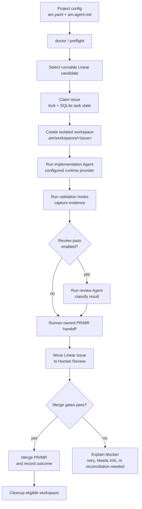

# Agent Machine

Agent Machine is a local-first runner for moving well-scoped Linear issues through
an isolated workspace, an Agent implementation pass, optional review, and a
GitHub PR / GitLab MR handoff.

The project is preparing for a v0.1 open-source release and currently dogfoods
itself. The design goal is conservative automation: Agent Machine should make
small, reviewable PRs, record useful evidence, and fail closed when ownership,
state, credentials, or scope are unclear.

## What It Does

- Polls a configured Linear project for runnable issues.
- Creates one isolated workspace per issue under `.am/workspaces/`.
- Runs an implementation Agent through a configured runtime provider.
- Runs validation hooks before and after the Agent attempt.
- Performs runner-owned code-host handoff: branch, commit, push, PR/MR
  create/update, identity validation, and deterministic handoff comments.
- Optionally runs a separate review pass before moving the Linear issue to
  Human Review.
- Records local SQLite state, progress snapshots, run records, evaluation
  artifacts, review classifications, cleanup decisions, and worker results.
- Merges only when conservative gates pass: expected branch/base/repository,
  approval, green checks, review evidence, app/author ownership, and clean state.



## Current Status

This repo owns the runner implementation, tests, specs, code-host/Linear
integrations, CLI, release packaging, and dogfood configuration. Consumer repos
should keep only their `am.yaml`, `am.agent.md`, and ignored
`.am/` runtime state.

Agent Machine is released under the MIT License.

See `docs/release/v0.1-readiness.md` for the current release checklist.

## Install

For local development:

```bash
mise install
mise exec go -- go run . --version
```

Tagged releases publish macOS and Linux archives for `amd64` and `arm64`.
Download the archive for your platform, verify it against `checksums.txt`, and
put the `am` binary on `PATH`.

When the Homebrew tap is configured:

```bash
brew install --cask weskor/tap/agent-machine
am --version
```

The Homebrew cask is a convenience install path for macOS. Linux users should use
the release archives unless and until Linux packages are added.

## Requirements

- Go through `mise` (`mise install`, then `mise exec go -- ...`).
- `codex` CLI on `PATH` for the default `codex_cli` runtime.
- Optional: `pi` CLI on `PATH` when `runtime.provider: pi_cli` is configured.
- Optional: `claude` CLI on `PATH` when `runtime.provider: claude_cli` is
  configured.
- A Linear API token.
- Code-host credentials for the configured repository provider:
  `GITHUB_TOKEN` / `GH_TOKEN` or GitHub App credentials for GitHub, or
  `GITLAB_TOKEN` / `GL_TOKEN` for GitLab.

## Quick Start

Install tool versions:

```bash
mise install
```

Create the two project files in the target repository:

```bash
cp am.example.yaml /path/to/target/am.yaml
cp am.agent.example.md /path/to/target/am.agent.md
```

Edit `/path/to/target/am.yaml`:

- `repository.remote`: clone URL for new workspaces.
- `repository.provider`: `github` by default; use `gitlab` for GitLab merge
  request handoff.
- `tracker.project_slug`: Linear project slug.
- `workspace.root`: workspace directory, usually `.am/workspaces`.
- `workspace.base_branch`: PR base branch, for example `main` or `develop`.
- `runtime.provider`: usually `codex_cli`; use `claude_cli` for Claude Code or
  `pi_cli` for the legacy Pi CLI runtime.
- `workflow.*`: Linear lane names for running, handoff, needs-info, and done.

Put secrets in the process environment, an explicit `--env-file`, or
`.env.local` next to the selected `am.yaml`:

```bash
LINEAR_API_KEY=lin_...
GITHUB_TOKEN=ghp_...
# For GitLab:
# GITLAB_TOKEN=glpat-...
```

For GitHub App auth, use:

```bash
GITHUB_APP_ID=...
GITHUB_APP_INSTALLATION_ID=...
GITHUB_APP_PRIVATE_KEY_PATH=./path/to/private-key.pem
```

For GitLab projects, configure the code host and expected MR author:

```yaml
repository:
  provider: gitlab
  remote: git@gitlab.com:OWNER/REPO.git
gitlab:
  endpoint: https://gitlab.com
  project: OWNER/REPO
  pr_author_override: agent-machine-bot
```

Process environment values win over `.env.local` values. Do not commit tokens,
private keys, absolute credential paths, or copied local env files.

Check the resolved config without contacting Linear or GitHub:

```bash
mise exec go -- go run . config print --config /path/to/target/am.yaml
```

Check first-run readiness without contacting Linear or GitHub:

```bash
mise exec go -- go run . doctor --config /path/to/target/am.yaml
```

Inspect current runner status:

```bash
mise exec go -- go run . status --config /path/to/target/am.yaml
```

Open the operator dashboard:

```bash
mise exec go -- go run . --config /path/to/target/am.yaml
```

Run one controlled implementation worker:

```bash
mise exec go -- go run . worker implementation --config /path/to/target/am.yaml
```

Run the production loop:

```bash
mise exec go -- go run . start --config /path/to/target/am.yaml
```

## Project Files

`am.yaml` is plain YAML for deterministic runner settings:

- repository clone remote;
- Linear tracker details and active states;
- workspace root and base branch;
- hooks and budgets;
- runtime provider and command overrides;
- review guidance;
- GitHub app/author ownership;
- lane names and required validation.

`am.agent.md` is the target-repository prompt template. It should explain
the repo’s domain, validation expectations, allowed ticket shape, and handoff
rules. It can use issue placeholders such as:

```markdown
- Identifier: {{issue.identifier}}
- Title: {{issue.title}}
- URL: {{issue.url}}
- State: {{issue.state}}
- Attempt: {{attempt}}
```

Use `agent.prompt_path` when the prompt file has a different name.

## Commands

Run commands from this repository. `--config` defaults to `am.yaml`.

| Command | Purpose |
| --- | --- |
| `go run .` or `go run . tui` | Open the read-only TUI dashboard. |
| `go run . config print` | Print the resolved, redacted config. No Linear/code-host access required. |
| `go run . doctor` | Check config, prompt, workspace, credentials, and runtime command readiness. No Linear/code-host access required. |
| `go run . --version` | Print the binary version. No config or credentials required. |
| `go run . status` | Print Linear, PR, workspace, SQLite, and artifact status. |
| `go run . run-status CAG-123` | Print one local progress line for an issue. No Linear/code-host access required. |
| `go run . run-ledger CAG-123` | Print the local append-only run timeline for an issue. `status CAG-123` is an alias. No Linear/code-host access required. |
| `go run . explain` | Print the next scheduling decision, merge blockers, and cleanup eligibility without mutating state. |
| `go run . start` | Run scheduler, cleanup, merge, handoff, review, and implementation lanes. |
| `go run . worker implementation` | Run one selected implementation worker process. |
| `go run . worker review` | Run one selected review worker process. |
| `go run . worker handoff` | Run one selected handoff worker process. |
| `go run . merge-approved` | Merge eligible Agent Machine-owned PRs whose gates pass. |
| `go run . cleanup-workspaces` | Inspect cleanup eligibility. Add `--apply` to delete eligible workspaces. |
| `go run . repair-artifacts` | Repair local Agent Machine artifacts. |
| `go run . surface snapshot` | Print the read-only JSON snapshot used by product surfaces. |

Legacy flag forms such as `--status`, `--explain`, `--continuous`,
`--worker=implementation`, and `--merge-approved` are still accepted, but new
docs should prefer command forms.

## TUI

The default product surface is a read-only OpenTUI dashboard over
`go run . surface snapshot`. It does not contact Linear or GitHub directly and
does not mutate workspaces, merge, repair, or clean up.

```bash
mise exec go -- go run . --config /path/to/target/am.yaml
```

You can also run the TUI package directly:

```bash
cd tui
bun install
bun run start -- --config ../am.yaml
```

Layout:

- Header: project, SQLite health, and snapshot timestamp or refresh error.
- Summary: issue, active-lock, lane, task, and reconciliation counts.
- Views rail: Overview, Issues, Lanes, Tasks, and Logs.
- List: rows for the selected view.
- Details: the selected row's key fields.

Controls:

- `tab`, `h`/`l`, or left/right arrows: switch views.
- `j`/`k` or up/down arrows: move the selected row.
- `1`-`5`: jump to Overview, Issues, Lanes, Tasks, or Logs.
- `r`: refresh the local snapshot.
- `q`: quit.

The TUI shells out to the local runner by default. Set `AM_BIN` to use an
already-built binary instead of `go run .`. The Logs view shows typed worker
results and recent orchestration events; raw Agent output stays in capped debug
artifacts and is not streamed into the dashboard.

## Runtime Providers

The default runtime is `codex_cli`. It shells out to a locally installed
`codex exec` command and passes the prepared prompt through stdin.

The legacy `pi_cli` runtime shells out to the Pi CLI and passes the prompt path
as an `@file` argument. Select it explicitly:

```yaml
runtime:
  provider: pi_cli
```

The `claude_cli` runtime shells out to Claude Code in non-interactive print mode
and passes the prepared prompt through stdin:

```yaml
runtime:
  provider: claude_cli
```

Runtime command overrides are available when a repository needs them:

```yaml
runtime:
  provider: codex_cli
  command: codex --ask-for-approval never exec --sandbox workspace-write
  review_command: codex --ask-for-approval never exec --sandbox read-only
```

For Claude Code, override the command when your environment needs a different
permission mode, model, or settings source:

```yaml
runtime:
  provider: claude_cli
  command: claude --print --no-session-persistence --output-format json --permission-mode acceptEdits
  review_command: claude --print --no-session-persistence --output-format json
```

The selected implementation and review commands are preflighted before the
runner claims an issue or mutates a workspace.

## Local State And Artifacts

Agent Machine stores runtime data under the configured workspace root:

- `.am/workspaces/<issue>`: isolated git workspace for one issue.
- `.am/state/am.db`: SQLite orchestration state.
- `.am/state/run-progress/<issue>/progress.json`: compact progress
  snapshots for operators.
- `.am-run.json`: attempt record written in the issue workspace.
- `.am-evaluation.json`: evaluation and merge-readiness summary.
- `.am/debug/<issue>/`: capped raw debug output when enabled.

SQLite state is the local source of truth for claims, leases, retries, worker
tasks, PR mappings, cleanup decisions, and terminal outcomes where implemented.
Artifacts are evidence exports and compatibility inputs; they should not be used
as the only authority for destructive or externally visible decisions.

## Development

Start with the project docs before changing behavior or architecture:

- `CONTEXT.md` and `LANGUAGE.md` for vocabulary.
- `docs/vision/agent-machine-v1.md` for the north star.
- `docs/agents/development-loop.md` for the spec-first development loop.
- `docs/agents/implementation.md` and `docs/agents/review.md` for agent-session
  expectations.
- `docs/specs/` and `docs/adr/` for behavior contracts and durable decisions.

Validation:

```bash
make fmt        # apply gofmt/goimports
make fmt-check  # verify gofmt/goimports formatting
make vet        # run go vet ./...
make lint       # run golangci-lint with the repository baseline
mise exec go -- go test ./...
make test       # run go test ./...
mise exec go -- make ci
git diff --check
```

Before handoff, run:

```bash
mise exec go -- make ci
git diff --check
```

For config or status changes, also run a safe local smoke:

```bash
mise exec go -- go run . config print --config am.yaml
```

## Live Smoke Harness

`cmd/agent-machine-live-smoke` is an opt-in operator harness. It creates or reuses
disposable Linear issues, generates an isolated config and prompt file, and runs
them with a deterministic fake Agent. It is not part of `make ci`.

Required gates:

- `LIVE_LINEAR=1`
- `LINEAR_API_KEY`
- GitHub credentials accepted by the runner

Create one disposable issue and run the fake-agent path:

```bash
LIVE_LINEAR=1 mise exec go -- go run ./cmd/agent-machine-live-smoke \
  --config am.yaml \
  --count 1
```

Run a concurrency-oriented smoke without merge:

```bash
LIVE_LINEAR=1 mise exec go -- go run ./cmd/agent-machine-live-smoke \
  --config am.yaml \
  --count 2 \
  --concurrency 2
```

The harness writes a JSON report under `.am/live-smoke/`. Merge checks are
disabled unless both controls are present:

To also write a public Markdown evidence report under `docs/smoke/`, add
`--public-report auto`. The report records the harness-controlled commands,
their exit status, issue links, and the evidence boundary; it does not replace
PR review, CI, Linear state inspection, or code-host merge evidence.
See `docs/smoke/dogfood-evidence.md` for the current public evidence index and
the evidence bar for future dogfood claims.

```bash
LIVE_LINEAR=1 LIVE_SMOKE_APPLY=1 mise exec go -- go run ./cmd/agent-machine-live-smoke \
  --config am.yaml \
  --from-report .am/live-smoke/live-smoke-YYYYMMDDTHHMMSSZ.json \
  --apply-merge \
  --public-report auto
```

Use `--from-report` for follow-up merge checks so the harness reuses the
original workspace root and artifact evidence.

Render a public evidence report from an existing JSON report without contacting
Linear:

```bash
mise exec go -- go run ./cmd/agent-machine-live-smoke \
  --render-report \
  --from-report .am/live-smoke/live-smoke-YYYYMMDDTHHMMSSZ.json \
  --public-report auto
```

## Dogfood Loop

Use small, reviewable Linear tickets when evaluating Agent Machine against itself
or another target repository.

1. Write tickets with `Goal`, `Scope`, `Requirements`, `Acceptance Criteria`,
   and `Validation`.
2. Move exactly one ticket into `Ready for Agent` when it is safe to run.
3. Run `go run . start --config am.yaml`, or use
   `go run . worker implementation --config am.yaml` for a controlled
   single-worker pass.
4. Review the PR before activating the next ticket.
5. Move unclear, unsafe, or credential-blocked work to `Needs Info` instead of
   guessing.

Objective review signals are scoped diff, no secrets, required validation,
passing CI/tests, clean `git diff --check`, review evidence or clear blocker
notes, and an expected `am/<issue>-workspace` PR into the configured base
branch.

## Release

Tagged releases are built by `.github/workflows/release.yml` with GoReleaser.
The workflow runs `make ci`, builds `am` for macOS and Linux on `amd64`
and `arm64`, attaches archives and `checksums.txt` to the GitHub release, and
publishes a Homebrew cask when `HOMEBREW_TAP_GITHUB_TOKEN` can write to
`weskor/homebrew-tap`.

Preflight a release locally:

```bash
mise exec go -- make ci
git diff --check
mise exec go -- make release-check
mise exec go -- make release-snapshot
```

Tag a rename patch release after the checklist is complete:

```bash
git tag v0.1.1
git push origin v0.1.1
```

## Repository Map

- `cmd/agent-machine-live-smoke/`: live smoke harness.
- `cmd/agent-machine-live-smoke-agent/`: deterministic fake smoke Agent.
- `internal/agentruntime/`: runtime provider adapters.
- `internal/cli/`: command parsing, config loading, env loading.
- `internal/config/`: `am.yaml` parsing and defaults.
- `internal/state/`: SQLite orchestration state.
- `docs/agents/`: repository-specific agent guidance.
- `docs/specs/`: observable behavior contracts.
- `docs/adr/`: durable architecture decisions.

## Safety Notes

- Do not commit `.env.local`, private keys, copied env files, or generated
  `.am/` runtime state.
- Do not batch unrelated work through one Linear issue.
- Do not run mutating cleanup with `--apply` unless status/explain output makes
  the cleanup reason clear.
- Treat missing Linear/code-host credentials, ambiguous tickets, stale locks,
  conflicting SQLite/artifact facts, and unexpected PR ownership as blockers.

## Security

See `SECURITY.md`. Do not report credentials, private keys, or vulnerable target
repository details in public issues.
